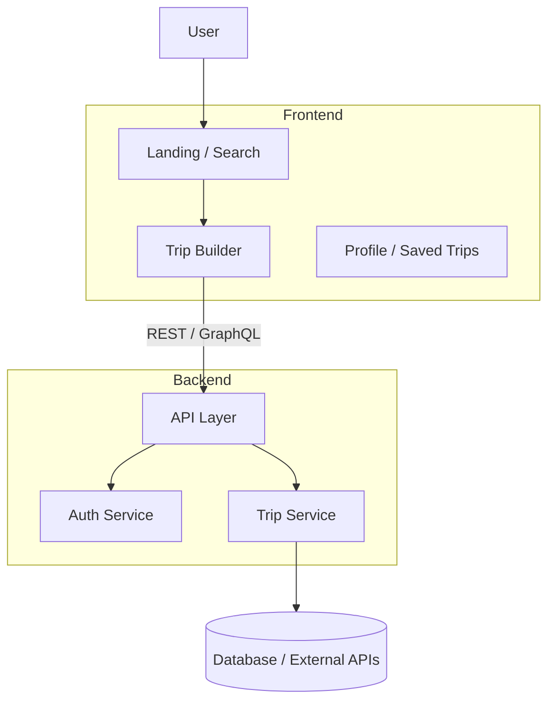
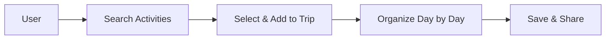

# OdooxKAHE

Welcome to OdooxKAHE — a modern travel planning web application focused on discovery, trip creation, and sharable itineraries.

Quick links

- [Overview](docs/overview.md)
- [Backend](docs/backend.md)
- [Frontend](docs/frontend.md)
- [Development & Run](docs/development.md)

Purpose

 - Help users discover activities and build day-by-day itineraries.
 - Provide a responsive, fast UI (Vite + React + TypeScript) with a lightweight Node backend.

High-level architecture

User journey — create a trip

Where to start

- Read the Project Overview for folder maps and feature lists.
- Open the `frontend` folder to run and explore UI components.
- Open the `backend` folder to inspect API endpoints and server logic.

Contributing

- Create a branch for your change and open a PR against `master`.
- Keep PRs focused and add screenshots or short video for UI changes.

Want more detail?

Open the linked docs for component-level diagrams, API overviews, and development steps.
# React + TypeScript + Vite

This template provides a minimal setup to get React working in Vite with HMR and some ESLint rules.

Currently, two official plugins are available:

- [@vitejs/plugin-react](https://github.com/vitejs/vite-plugin-react/blob/main/packages/plugin-react) uses [Oxc](https://oxc.rs)
- [@vitejs/plugin-react-swc](https://github.com/vitejs/vite-plugin-react/blob/main/packages/plugin-react-swc) uses [SWC](https://swc.rs/)

## React Compiler

The React Compiler is not enabled on this template because of its impact on dev & build performances. To add it, see [this documentation](https://react.dev/learn/react-compiler/installation).

## Expanding the ESLint configuration

If you want stricter, type-aware linting for TypeScript files, enable the type-checked ESLint configs in your `frontend` ESLint configuration (for example, `recommendedTypeChecked` or `strictTypeChecked`). See `frontend/eslint.config.js` for a ready-made example and recommended parser options.

You can enable React-specific linting by installing `eslint-plugin-react-x` and `eslint-plugin-react-dom`, then enabling their recommended configs in your `frontend` ESLint configuration. See `frontend/eslint.config.js` for a project example and for type-aware linting recommendations.
