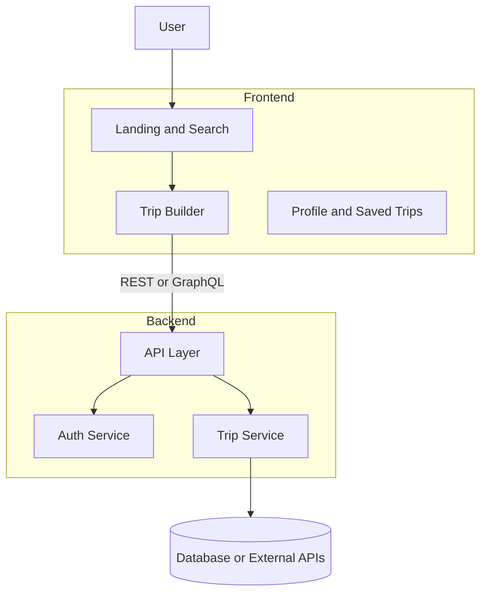
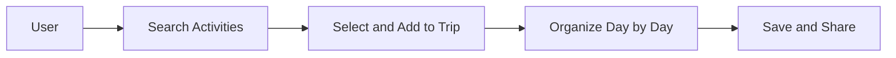

# OdooxKAHE

Welcome to OdooxKAHE — a modern travel planning web application focused on discovery, trip creation, and sharable itineraries.

## Documentation

Comprehensive documentation organized into 5 sections:

| File | Purpose |
|------|---------|
| **[README.md](README.md)** | Project overview, features, quick start |
| **[architecture.md](docs/architecture.md)** | System design, tech stack, high-level architecture |
| **[frontend.md](docs/frontend.md)** | React structure, pages, components, flows |
| **[backend.md](docs/backend.md)** | Services, controllers, database schema, auth *template* |
| **[API.md](docs/API.md)** | REST endpoints, requests/responses, auth *template* |

**New to the project?** Start with:
1. Read [architecture.md](docs/architecture.md) for high-level overview
2. Follow [Getting Started](#-getting-started) to set up locally
3. Explore [frontend.md](docs/frontend.md) to understand the UI layer

**Working on the backend?** Fill in [backend.md](docs/backend.md) and [API.md](docs/API.md) with your actual implementation

## About the Project

OdooxKAHE helps users discover activities, build multi-day itineraries, and share trips with friends. The platform combines a responsive React frontend with a Node.js backend to provide a seamless travel planning experience.

**Built with:**
- Frontend: Vite + React + TypeScript
- Backend: Node.js (Express)
- State Management: React Query / QueryProvider

## High-Level Architecture



## User Journey



## Key Features

- **Discovery** — Search and browse activities by city, category, or keyword
- **Trip Builder** — Compose itineraries with drag-and-drop day organization
- **Optimistic UI** — Changes appear instantly with background sync
- **Save & Share** — Export as PDF or create shareable links
- **User Accounts** — Manage trips, packing lists, and shared itineraries

## Project Structure

```
frontend/          # React UI (Vite, TypeScript)
backend/           # Node.js API server
docs/              # Comprehensive guides
  ├── ARCHITECTURE.md    # System design & flows
  └── GETTING_STARTED.md # Setup & development
```

## Getting Started

For a complete setup guide, see **[GETTING_STARTED.md](docs/GETTING_STARTED.md)**.

### Quick Start (2 terminals)

**Terminal 1 — Frontend:**

```bash
cd frontend
npm install
npm run dev
```

Open `http://localhost:5173`

**Terminal 2 — Backend:**

```bash
cd backend
npm install
npm run dev
```

API runs on port 5000 (or your configured port)

## Contributing

1. Create a feature branch: `git checkout -b feature/my-feature`
2. Make your changes and commit: `git commit -m "feat: add awesome feature"`
3. Push and open a PR: `git push origin feature/my-feature`

See [FRONTEND.md](docs/FRONTEND.md) for coding patterns and structure.

## Need Help?

- **How do I set up the project?** → See [Getting Started](#-getting-started)
- **Where's the code organized?** → See [frontend.md](docs/frontend.md)
- **What are the backend services?** → See [backend.md](docs/backend.md)
- **What's the API structure?** → See [API.md](docs/API.md)
- **How does data flow?** → See [architecture.md](docs/architecture.md)

## License

[Add your license here]

