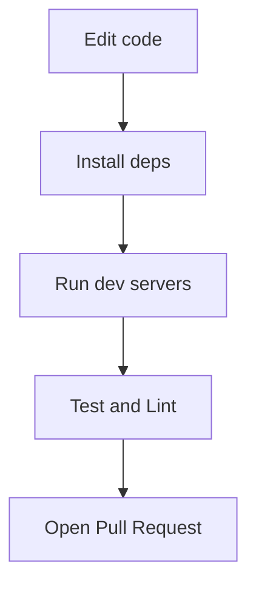

# GETTING_STARTED — Development & Setup Guide

Quick setup and development instructions for OdooxKAHE.

---

## Table of Contents

1. [Prerequisites](#prerequisites)
2. [Project Structure](#project-structure)
3. [Local Setup](#local-setup)
4. [Running the Application](#running-the-application)
5. [Development Workflow](#development-workflow)
6. [Troubleshooting](#troubleshooting)
7. [Next Steps](#next-steps)

---

## Prerequisites

Before starting development, ensure you have:

- **Node.js** — LTS 18+ ([download](https://nodejs.org))
- **npm** or **yarn** — Package manager (comes with Node.js)
- **Git** — Version control
- **A code editor** — VS Code recommended

**Verify installations:**

```bash
node --version
npm --version
git --version
```

---

## Project Structure

```
OdooxKAHE/
├── frontend/                    # React + TypeScript UI app
│   ├── src/
│   │   ├── app/                # App layout and routing
│   │   ├── modules/            # Feature modules (landing, auth, trips, etc.)
│   │   ├── shared/             # Shared types, hooks, services, utils
│   │   ├── store/              # Global state
│   │   ├── App.tsx
│   │   └── main.tsx
│   ├── package.json
│   ├── vite.config.ts
│   └── tsconfig.json
│
├── backend/                     # Node.js / Express API
│   ├── package.json
│   ├── src/
│   │   ├── routes/             # API endpoints
│   │   ├── services/           # Business logic
│   │   └── index.ts
│   └── .env.example
│
├── docs/
│   ├── ARCHITECTURE.md         # System design and flows (this file's companion)
│   └── GETTING_STARTED.md      # Setup and development (you are here)
│
├── README.md                    # Project overview
└── package.json                 # Root monorepo config (optional)
```

---

## Local Setup

### Step 1: Clone the Repository

```bash
git clone https://github.com/Yugenjr/OdooxKAHE.git
cd OdooxKAHE
```

### Step 2: Set Up the Frontend

```bash
cd frontend
npm install
```

**Check installation:**

```bash
npm run build
```

If the build succeeds, the frontend is ready.

### Step 3: Set Up the Backend

```bash
cd ../backend
npm install
```

**Environment variables:**

Copy `.env.example` to `.env` and fill in your configuration:

```bash
cp .env.example .env
# Edit .env with your database, API keys, ports, etc.
```

**Common variables:**

```
NODE_ENV=development
PORT=5000
DATABASE_URL=<your-database-connection>
JWT_SECRET=<your-jwt-secret>
```

---

## Running the Application

### Terminal 1: Frontend Dev Server

From the `frontend/` directory:

```bash
npm run dev
```

The app will start at `http://localhost:5173` (Vite default).

**Output should show:**

```
VITE v4.x.x  ready in xxx ms

➜  Local:   http://localhost:5173/
➜  press h to show help
```

### Terminal 2: Backend API Server

From the `backend/` directory:

```bash
npm run dev
```

The API will start on the port defined in `.env` (typically `5000`).

**Output should show:**

```
Server running on http://localhost:5000
```

### Verify Both Are Running

- **Frontend:** Open `http://localhost:5173` in your browser
- **Backend:** Test API health with `curl http://localhost:5000/health` (or similar endpoint)

---

## Development Workflow



### Making Changes

1. **Frontend changes:** Edit files in `frontend/src/`
   - Vite HMR will auto-refresh your browser
   - Check console for TypeScript errors

2. **Backend changes:** Edit files in `backend/src/`
   - Restart the dev server to apply changes (if not using auto-reload)

3. **Shared types:** Edit `frontend/src/shared/types/`
   - Update and re-export shared types from the backend

### Testing & Linting

**Frontend:**

```bash
cd frontend
npm run lint        # Run ESLint
npm run typecheck   # Run TypeScript type checking
npm run test        # Run unit tests (if configured)
```

**Backend:**

```bash
cd backend
npm run lint        # Run linter
npm run test        # Run tests (if configured)
```

### Adding Dependencies

**Frontend:**

```bash
cd frontend
npm install <package-name>
```

**Backend:**

```bash
cd backend
npm install <package-name>
```

---

## Development Workflow

### 1. Start Dev Servers

Open two terminals:

**Terminal 1 (Frontend):**

```bash
cd frontend
npm run dev
```

**Terminal 2 (Backend):**

```bash
cd backend
npm run dev
```

### 2. Edit Code

- Frontend changes reload instantly (HMR)
- Backend changes may require restart

### 3. Test Your Changes

- Visit `http://localhost:5173` to see the UI
- Check console for errors
- Test API endpoints with Postman or curl

### 4. Commit & Push

```bash
git checkout -b feature/my-feature
git add .
git commit -m "feat: add awesome feature"
git push origin feature/my-feature
```

### 5. Open Pull Request

Create a PR against the `master` branch with a clear description.

---

## Helpful Tips

### 1. Using QueryProvider for UI-Only Work

When developing UI without a working backend:

```typescript
// Use mock data in QueryProvider
const mockData = { activities: [...] };
// Return mock data instead of calling API
```

### 2. Port Conflicts

If ports are already in use:

**Frontend (change Vite port):**

Edit `frontend/vite.config.ts`:

```typescript
export default defineConfig({
  server: {
    port: 3000, // Change to available port
  },
});
```

**Backend (change API port):**

Edit your `.env`:

```
PORT=3001
```

### 3. TypeScript Errors

Ensure you're using correct types from `frontend/src/shared/types`:

```typescript
import { Trip, Activity } from '@/shared/types';

const trip: Trip = { /* ... */ };
```

### 4. Database Connectivity

If the backend fails to connect:

1. Check `.env` — verify `DATABASE_URL` is correct
2. Ensure database server is running
3. Check firewall/network permissions
4. See backend logs for detailed error messages

### 5. Clear Node Modules

If you encounter strange errors:

```bash
rm -rf node_modules package-lock.json
npm install
```

---

## Troubleshooting

### Frontend won't start

**Error:** `Port 5173 already in use`

**Solution:** Change the port in `vite.config.ts` (see [Port Conflicts](#port-conflicts))

---

### Backend won't start

**Error:** `Error: connect ECONNREFUSED`

**Solution:** Check `.env` and ensure database is running

**Error:** `Cannot find module`

**Solution:** Run `npm install` in the `backend/` directory

---

### API calls return 404

**Error:** `GET /api/activities → 404`

**Solution:**
1. Verify backend is running (`http://localhost:5000`)
2. Check endpoint spelling in apiService
3. Ensure backend has the route defined

---

### TypeScript errors in IDE

**Error:** `Cannot find module '@/shared/types'`

**Solution:** Ensure `tsconfig.json` has the correct path mapping and you're in the `frontend/` directory

---

### Optimistic UI not working

**Symptom:** Changes don't appear or rollback immediately

**Solution:** Check backend endpoint — ensure mutation endpoint returns correct data

---

## Next Steps

1. **Read the Architecture Guide** — Open [architecture.md](architecture.md) to understand the system design and user flows

2. **Explore the Codebase** — Familiarize yourself with the feature modules in `frontend/src/modules`

3. **Set Up Git Hooks (optional)** — Configure pre-commit hooks to run lint checks

4. **Review Backend Docs** — Check `backend/` for API documentation and available endpoints

5. **Start Contributing** — Pick an issue or feature and create a branch

---

## Quick Command Reference

| Command | Purpose |
|---------|---------|
| `npm run dev` | Start dev server (frontend or backend) |
| `npm run build` | Build for production |
| `npm run lint` | Run ESLint |
| `npm run typecheck` | Run TypeScript type checking |
| `npm run test` | Run tests |
| `npm install <pkg>` | Add a dependency |

---

**Questions?** Check [architecture.md](architecture.md) for system design questions or review the README.md for project overview.
