# Architecture & System Design

This document explains the high-level system design, technology decisions, and architecture of OdooxKAHE.

---

## System Overview

OdooxKAHE is a full-stack travel planning platform with:
- **Frontend:** Vite + React + TypeScript (modern, fast development)
- **Backend:** Node.js + Express (assumed from package.json)
- **State Management:** React Query via QueryProvider pattern
- **Styling:** Tailwind CSS
- **Build:** Vite with Hot Module Replacement

---

## Architecture Diagram

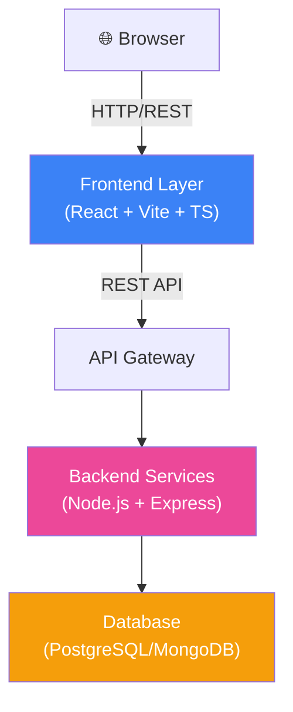

---

## Tech Stack Decisions

### Why Vite + React?

**Vite:**
- ⚡ Near-instant dev server startup
- 🔥 Hot Module Replacement (HMR) for instant feedback
- 📦 Smaller production bundles
- ✨ Native ES modules in dev

**React + TypeScript:**
- 💪 Strong type safety
- 🧩 Component-based architecture
- 📚 Massive ecosystem
- ♻️ Reusable UI logic with hooks

### Why React Query (QueryProvider)?

**Instead of Redux/Zustand:**
- ✅ Automatic caching and refetching
- ✅ Built-in optimistic UI support
- ✅ Handles stale data automatically
- ✅ Request deduplication
- ✅ Less boilerplate

**Server state vs. UI state:**
- React Query manages server data (API responses)
- Component hooks manage local UI state
- Much cleaner separation of concerns

### Why Node.js + Express Backend?

- ✅ JavaScript/TypeScript across full stack
- ✅ Fast REST API development
- ✅ Rich middleware ecosystem
- ✅ Async/await support
- ✅ Easy authentication (JWT, OAuth)

---

## Data Flow at a Glance

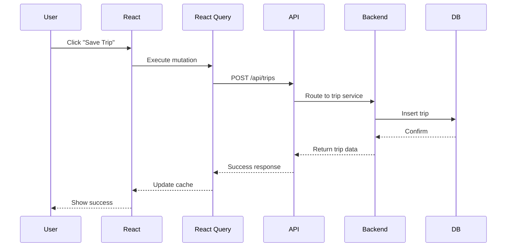

---

## API Integration Pattern

All API calls follow this flow:

1. **Page Component** → Calls React Query hook
2. **Hook** → Calls `apiService.method()`
3. **apiService** → Makes HTTP request with auth headers
4. **Backend** → Processes and returns data
5. **React Query** → Caches response automatically
6. **Component** → Re-renders from cache

**Centralized in:** `frontend/src/shared/services/apiService.ts`

---

## Next Steps

- **Setup & Development:** [GETTING_STARTED.md](GETTING_STARTED.md)
- **Frontend Architecture:** [FRONTEND.md](FRONTEND.md)
- **Backend Services:** [BACKEND.md](BACKEND.md)
- **API Reference:** [API.md](API.md)

---

## System Overview

OdooxKAHE is a travel-planning web application enabling users to discover activities, build multi-day itineraries, and share trips with friends.

**Key Technology Stack:**
- Frontend: Vite + React + TypeScript
- Backend: Node.js (Express) API
- State Management: QueryProvider (React Query or similar)
- Shared Types: `frontend/src/shared`

**High-level Architecture:**

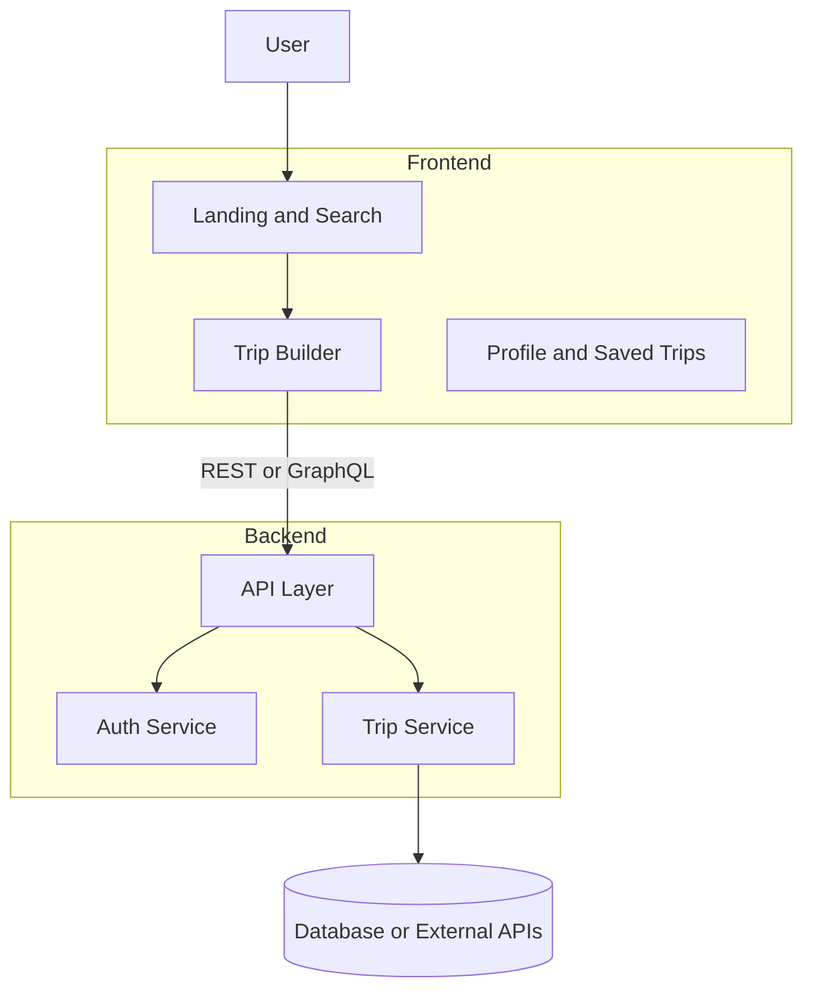

---

## App Component Hierarchy

The React app is structured with global providers and layout wrappers shared across all pages:

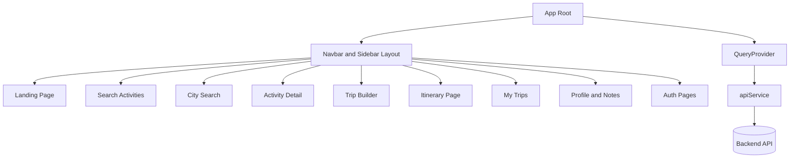

**Key Components:**

- **App Root** — Bootstraps the entire application and registers global providers
- **QueryProvider** — Manages data fetching, caching, and mutations; handles global error states
- **Navbar + Sidebar Layout** — Persistent navigation wrappers shared across all pages
- **Pages** — Individual route modules organized by feature (landing, auth, trips, activities, dashboard, etc.)
- **apiService** — Centralized HTTP client used by all pages and the query provider for backend communication

---

## Pages & Responsibilities

### Public Pages (No Authentication Required)

| Page | Location | Purpose |
|------|----------|---------|
| **Landing** | `modules/landing` | Marketing hub, feature highlights, call-to-action for signup/login |
| **Search** | `modules/activities/ActivitySearchPage` | Full-text search, filters, results list for activities |
| **City Search** | `modules/activities/CitySearchPage` | City-focused discovery and browse experience |
| **Activity Detail** | `shared/detail components` | Full activity info, images, availability, Add to trip action |

### Authenticated Pages (Auth Required)

| Page | Location | Purpose |
|------|----------|---------|
| **Trip Builder** | `modules/trips/CreateTripPage` | Compose itineraries: add, reorder, organize activities by day/time |
| **Itinerary** | `modules/itinerary/ItineraryPage` | Review, finalize, and export day-by-day plans |
| **My Trips** | `modules/trips/MyTripsPage` | List of saved trips; edit, duplicate, delete, or share |
| **Profile / Notes** | `modules/profile/pages/*` | User settings, packing lists, trip notes, manage shared trips |
| **Dashboard** | `modules/dashboard/pages/*` | Curated suggestions, analytics, and trip recommendations |

### Auth Module

| Page | Location | Purpose |
|------|----------|---------|
| **Login** | `modules/auth/LoginPage` | User authentication with optional social login |
| **Signup** | `modules/auth/SignupPage` | New account creation |

---

## User Navigation Flows

### Flow 1: High-Level Journey (Discovery → Save)

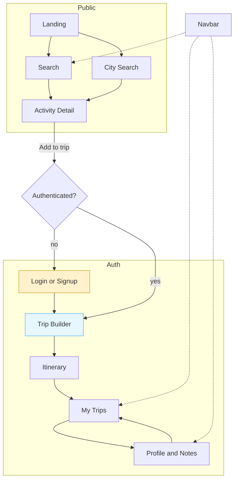

**Key Insights:**
- Public pages allow exploration without authentication
- Adding to a trip triggers auth gate if not logged in
- After login, user is returned to the Trip Builder
- Navbar provides shortcuts to major sections

### Flow 2: Detailed User Journey (Landing → Trip Saved)

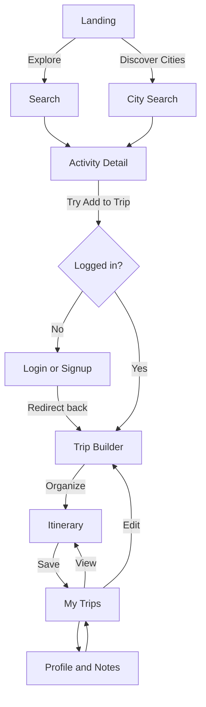

**Flow Description:** User begins with discovery, views activity details, attempts to add to trip (auth required), builds itinerary, saves trip, and can revisit/edit later.

### Flow 3: Add-to-Trip Modal (Optimistic Updates)

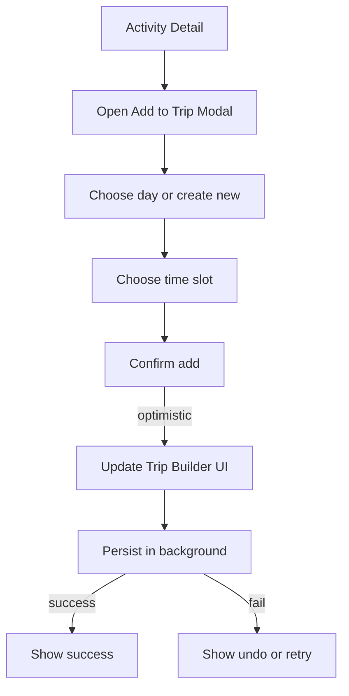

**Pattern:** Uses optimistic UI updates (show change immediately) while syncing to backend in background. Failures are rollable.

### Flow 4: Trip Builder Operations (Composition)

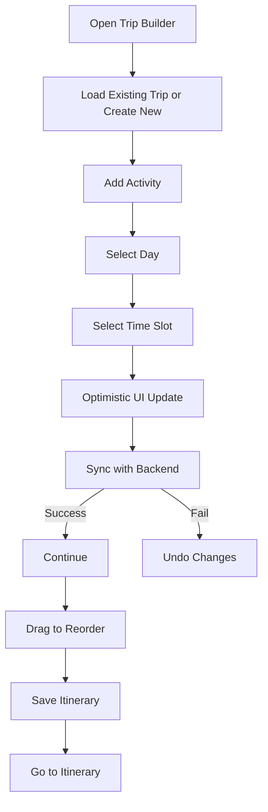

**Features:**
- Load or create new trips
- Add activities with day/time selection
- Optimistic updates with background sync
- Drag-and-drop reordering
- Save and finalize itineraries

### Flow 5: Auth Redirect Pattern

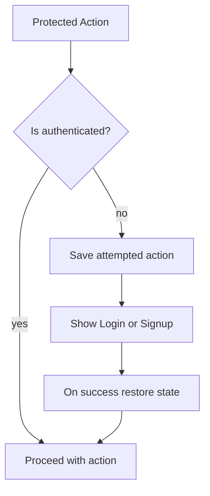

**Benefit:** Users don't lose context when forced to authenticate. After login, they're returned to complete their original action.

### Flow 6: Save & Export

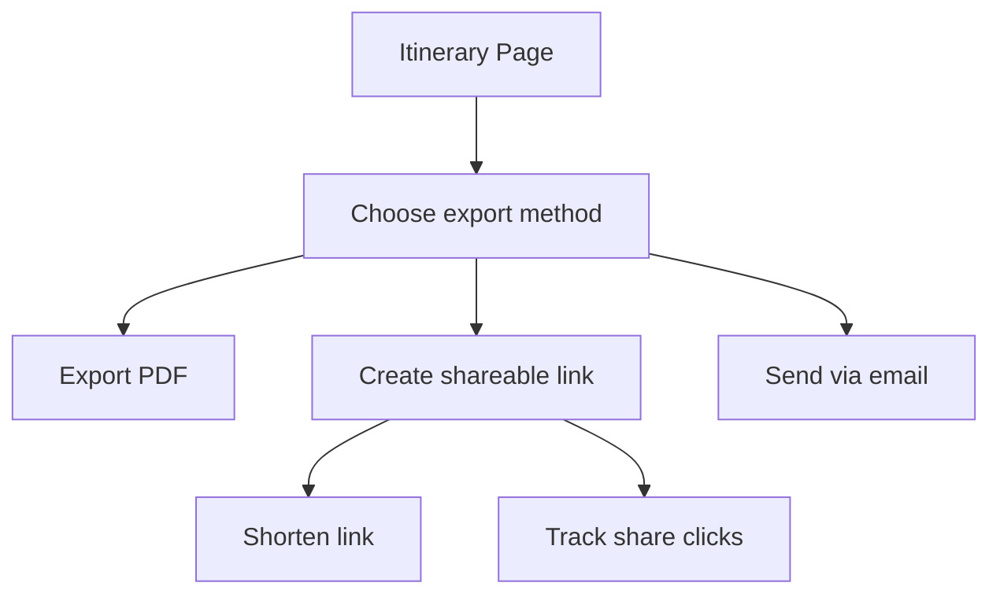

---

## Data & API Flows

### Frontend-to-Backend Data Flow

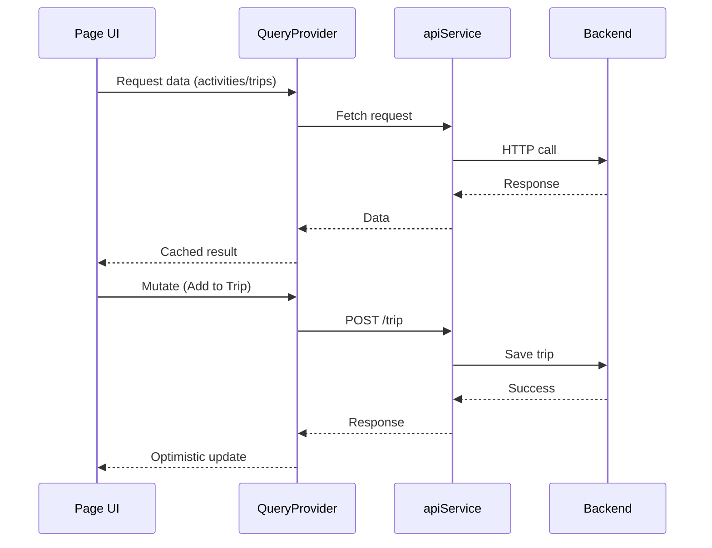

**Key Pattern:**
- Queries are cached and reused
- Mutations trigger optimistic UI updates
- Background sync ensures data consistency
- Global error handling through QueryProvider

### API Endpoints by Page

Each frontend page depends on specific backend endpoints:

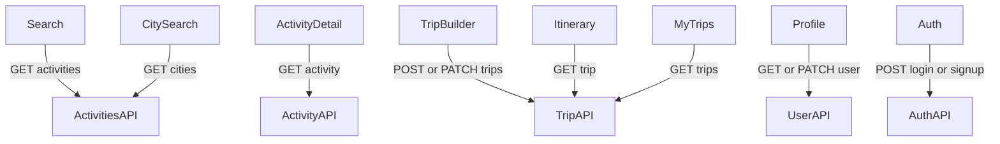

### Persistent Navigation

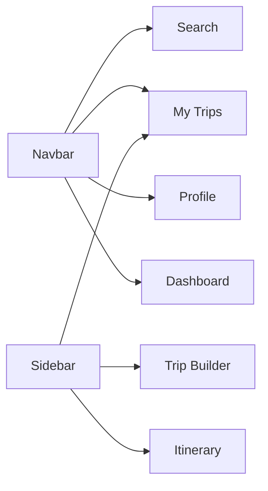

**Purpose:** Users can jump between major sections without losing current work. Both Navbar and Sidebar provide quick access to frequently used pages.

---

## Technical Patterns

### 1. Optimistic UI Updates

When users add activities or make changes:
1. Immediately update the UI (optimistic)
2. Send mutation to backend
3. On success: keep UI as-is
4. On failure: rollback UI and show error

**Benefit:** Perceived responsiveness, better UX

### 2. Global Query Caching

The QueryProvider caches all API responses:
- Repeated queries return cached data without re-fetching
- Mutations invalidate related caches for consistency
- Reduces network traffic and improves performance

### 3. Auth-Protected Flows

Protected actions (Add to Trip, Save) require authentication:
1. Check authentication state
2. If unauthenticated: save action context and show login
3. After auth: resume original action

**Benefit:** Seamless experience, no context loss

### 4. Separation of Concerns

- **Pages** handle routing and user interactions
- **QueryProvider** manages data and state
- **apiService** handles HTTP communication
- **Components** are reusable and composable

---

## Component Responsibilities

- `QueryProvider` (providers/QueryProvider.tsx) — Central data fetching, caching, mutations, error handling
- `Navbar`, `Sidebar` (components) — Persistent navigation and quick access
- `apiService` (services/apiService.ts) — Unified HTTP client
- `shared/types` — Data contracts shared between frontend and backend
- `shared/hooks` — Custom React hooks for common patterns

---

**For setup and development instructions, see [GETTING_STARTED.md](GETTING_STARTED.md).**
