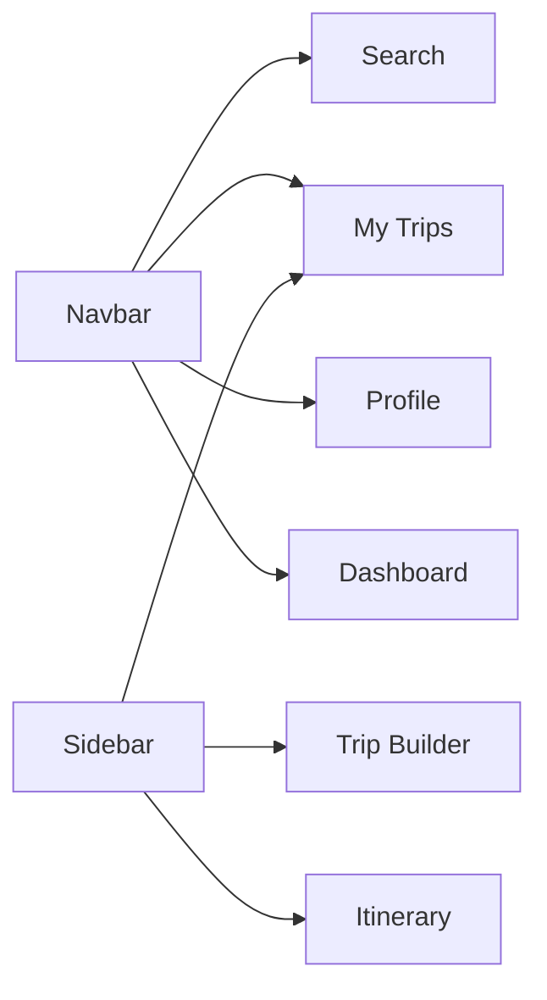
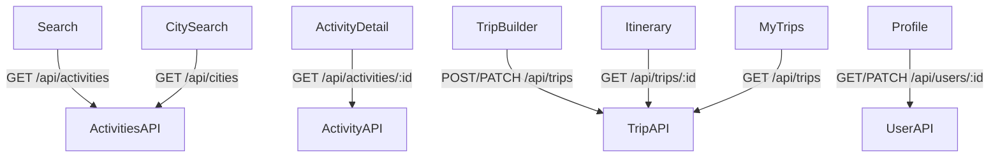

# Architecture & App Structure

This document describes the high-level structure of the OdooxKAHE frontend, from the root App component down through providers, layouts, and pages.

## App Component Hierarchy

The diagram below shows how the React app is organized, including global providers and layout wrappers:

Key responsibilities:

- `App Root` — bootstraps the entire app and registers global providers
- `QueryProvider` — manages data fetching, caching, mutations (React Query or similar)
- `Navbar + Sidebar Layout` — persistent navigation wrapper shared across all pages
- `Pages` — individual route modules (landing, search, trip builder, etc.)
- `apiService` — centralized HTTP client used by all pages and the query provider

## Quick Navigation Paths

The Navbar and Sidebar offer shortcuts to key areas:

## Page-to-Backend API Dependencies

The diagram below shows which backend endpoints each page relies on:

---

For step-by-step user journeys and detailed page flows, see [Pages & User Flows](pages-flow.md).
