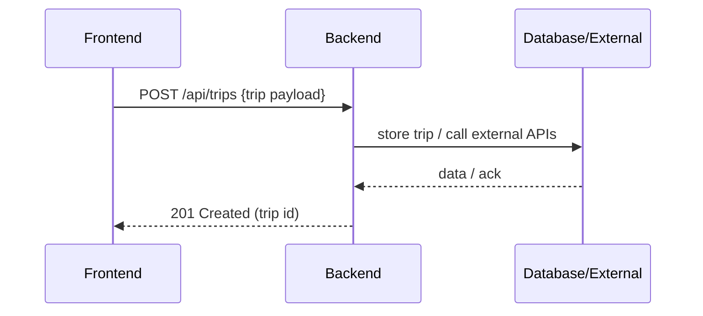
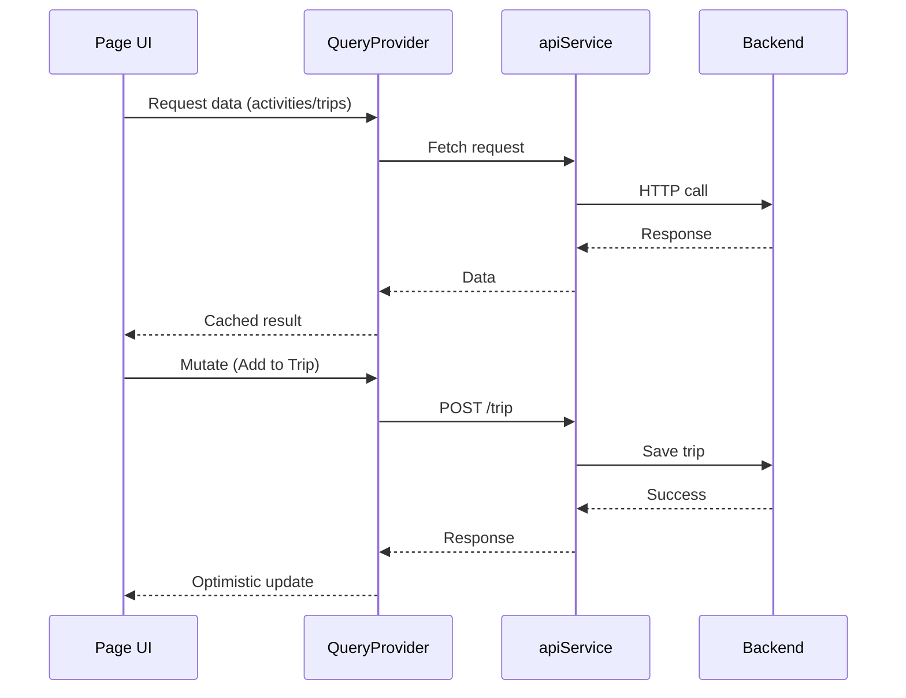
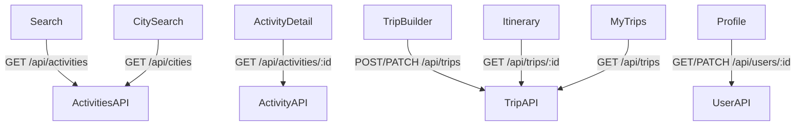

# Backend

Location: `backend/`

Purpose

- Provide API endpoints for authentication, trip management, and integrations with external activity providers.
- Responsible for data validation, persistence, and business rules.

Core services

- Auth Service — user sessions, token management
- Trip Service — CRUD for trips and itineraries
- Integration Layer — adapters to third-party activity APIs

Request/response flow

Helpful notes

- Inspect `backend/package.json` for available scripts and environment variables.
- Look for `.env` or config files for database connection and API keys.

Data & contracts

- Shared types live in `frontend/src/shared/types` — use these as the source of truth for API payloads.

## Frontend-to-Backend Data Flow

The diagram below shows how data flows from the UI through the QueryProvider and apiService to the backend:

Caption: Queries are cached and reused; mutations trigger optimistic UI updates with background sync to the backend.

## API Endpoints by Page

Each frontend page depends on specific backend endpoints:

Caption: Use this diagram to map which pages call which endpoints, helping you understand backend contract changes and their impact on the frontend.

