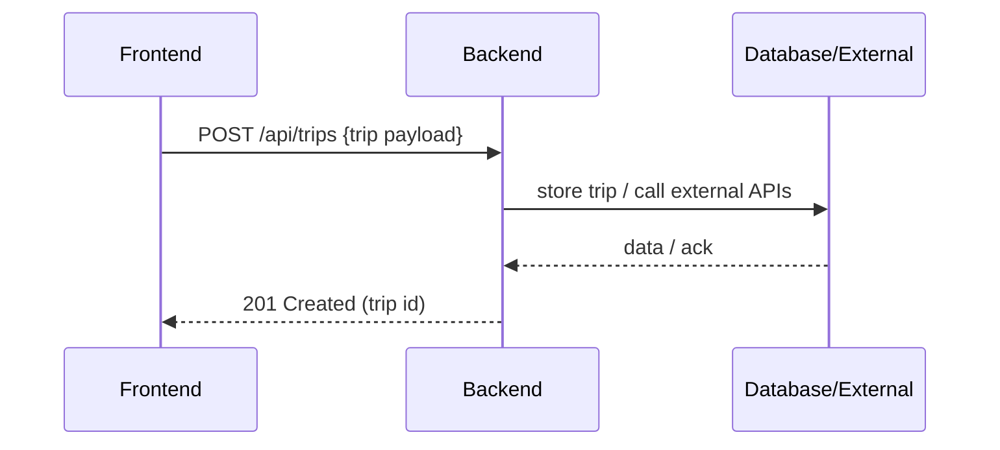

# Backend

Location: `backend/`

Purpose

- Provide API endpoints for authentication, trip management, and integrations with external activity providers.
- Responsible for data validation, persistence, and business rules.

Core services

- Auth Service — user sessions, token management
- Trip Service — CRUD for trips and itineraries
- Integration Layer — adapters to third-party activity APIs

Request/response flow

Helpful notes

- Inspect `backend/package.json` for available scripts and environment variables.
- Look for `.env` or config files for database connection and API keys.

Data & contracts

- Shared types live in `frontend/src/shared/types` — use these as the source of truth for API payloads.

