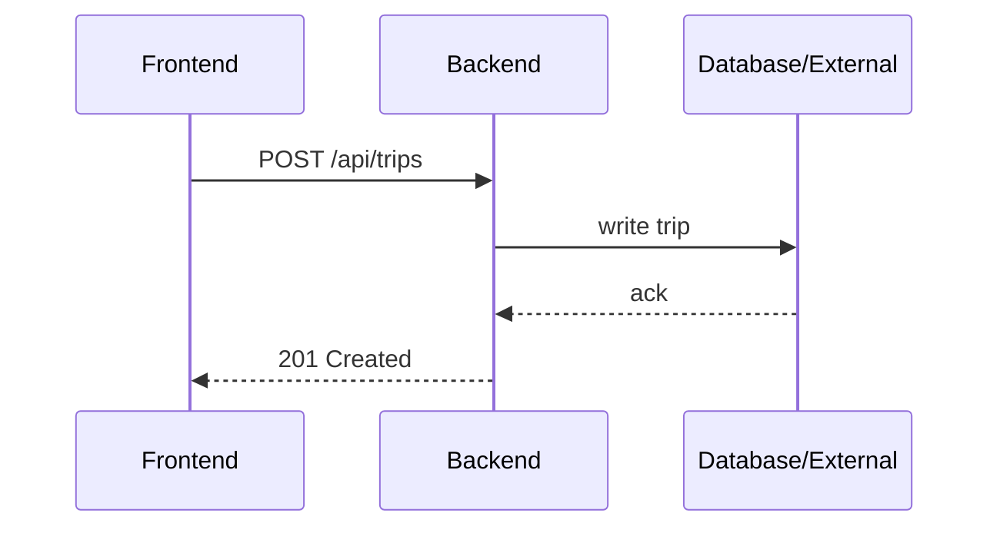

# Backend

Location: `backend/`

Overview:
- Likely contains an Express/Node API (see [backend/package.json](backend/package.json)).
- Responsibilities: authenticate users, serve trip/itinerary endpoints, proxy external activity APIs, persist data.

Request flow:


Run (example):
```bash
cd backend
npm install
npm run dev
```

Check [backend/package.json](backend/package.json) for actual scripts and env requirements.
