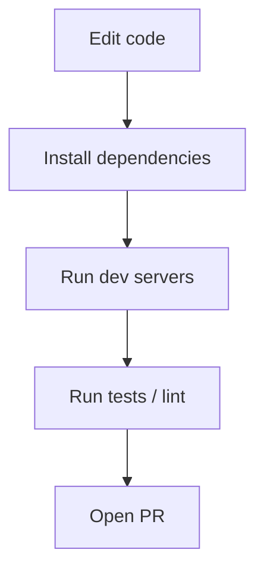

# Development & Run

This file explains how to set up and run the project locally.

Prerequisites:
- Node.js 18+ (or project-specific)
- npm or yarn

Steps:
```bash
# From repo root
cd frontend
npm install
npm run dev

# In a separate terminal
cd ../backend
npm install
npm run dev
```

Dev workflow (diagram):


Notes:
- Check `frontend/package.json` and `backend/package.json` for accurate scripts.
- If ports conflict, update the dev server port in `vite.config.ts` or backend config.
