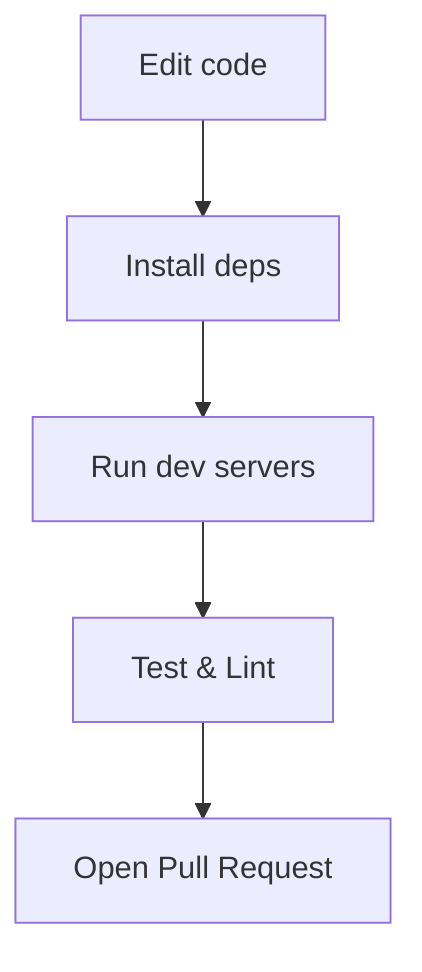

# Development & Run

This section explains how contributors typically set up the project and the common development workflow.

Prerequisites

- Node.js (recommend LTS 18+)
- npm or yarn

Local setup overview

- Install frontend dependencies and run the Vite dev server to work on UI.
- Install backend dependencies and run the API server to handle requests.
- Keep both servers running in separate terminals for full end-to-end iteration.

Developer workflow

Helpful tips

- Inspect `frontend/package.json` and `backend/package.json` for available npm scripts.
- Use the `QueryProvider` to simulate API responses for UI-only work.
- If ports conflict, adjust the Vite dev server port or backend port in the respective config files.

If you want, I can add runnable example commands in a separate `docs/run-commands.md` file so these instructions stay descriptive here while keeping copy-pasteable commands in one place.
