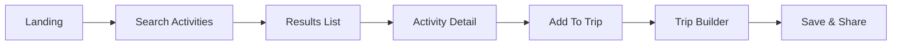

# Frontend

Location: `frontend/` — Vite + React + TypeScript

Structure & pages

- `modules/landing` — marketing and hero sections
- `modules/auth` — `LoginPage`, `SignupPage`
- `modules/trips` — `CreateTripPage`, `MyTripsPage`, trip builder
- `shared` — utilities, services, hooks used across pages

Routing & UI flow

UI Design notes

- Components attempt to be small and composable (cards, lists, modals).
- `QueryProvider` centralizes data fetching and caching logic.
