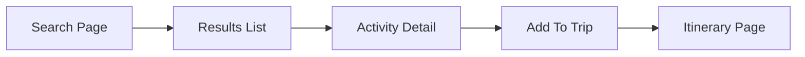

# Frontend

Location: `frontend/` — Vite + React + TypeScript app.

Main entry: `frontend/src/main.tsx` (check `frontend/package.json` scripts).

Core pages (examples exist in `frontend/src/modules`):
- `modules/landing` — Landing page and marketing sections
- `modules/auth` — `LoginPage`, `SignupPage`
- `modules/trips` — `CreateTripPage`, `MyTripsPage`

User interaction flow (search → add → save):


Run (example):
```bash
cd frontend
npm install
npm run dev
```
