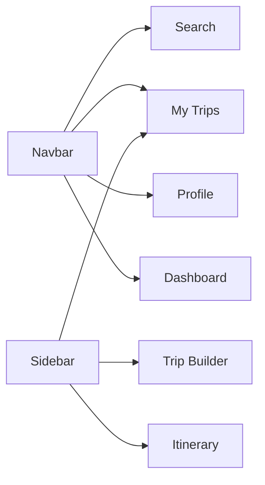

# Frontend

Location: `frontend/` — Vite + React + TypeScript

This document describes the main pages, their responsibilities, and the typical user navigation (logical flow) between pages.

Pages and responsibilities

- Landing (modules/landing): introduces the product, highlights features, and funnels users to search or signup.
- Search (modules/activities/pages/ActivitySearchPage.tsx): search bar, filters, and results list for activities and experiences.
- City Search (modules/activities/pages/CitySearchPage.tsx): city-focused discovery and browse experience.
- Activity Detail (shared/detail components): full activity data, images, availability, and an "Add to trip" action.
- Trip Builder / Create Trip (modules/trips/pages/CreateTripPage.tsx): drag/drop or list UI to organize activities into days and times.
- Itinerary (modules/itinerary/pages/ItineraryPage.tsx): review, reorder, and export day-by-day plans.
- My Trips (modules/trips/pages/MyTripsPage.tsx): list of saved trips, actions to edit, duplicate, or share.
- Profile & Notes (modules/profile/pages/*): user settings, packing lists, notes, and shared trips management.
- Auth pages (modules/auth/pages/LoginPage.tsx, SignupPage.tsx): sign in/up flows and social auth hooks.
- Dashboard / Inspiration (modules/dashboard/pages/*): curated suggestions, analytics, and recommendations.

Component responsibilities

- `QueryProvider` (providers/QueryProvider.tsx): central data fetching, caching, and global error handling.
- `Sidebar`, `Navbar` (components): persistent navigation and quick access to trips and profile.
- `services/apiService.ts`: unified API client used across pages.

Persistent navigation (Navbar & Sidebar)

Every page is wrapped in a layout that includes the Navbar at the top and an optional Sidebar for quick navigation:



This allows users to jump between major sections without losing their current work.

User logical flow (page-to-page navigation)

The diagram below models common user journeys and conditional transitions (e.g., auth required):

```mermaid
flowchart TD
  subgraph Public
    L[Landing]
    S[Search]
    C[City Search]
    D[Activity Detail]
  end

  subgraph Auth
    Login[Login / Signup]
    Builder[Trip Builder]
    Itin[Itinerary]
    MyTrips[My Trips]
    Profile[Profile / Notes]
  end

  L --> S
  L --> C
  S --> D
  C --> D
  D -->|Add to trip (unauthenticated)| Login
  D -->|Add to trip (authenticated)| Builder
  Login --> Builder
  Builder --> Itin
  Itin --> MyTrips
  MyTrips --> Profile
  Profile --> MyTrips

  %% shortcuts
  Navbar[Navbar] -.-> S
  Navbar -.-> MyTrips
  Navbar -.-> Profile

  style Login fill:#fff2cc,stroke:#cc9a00
  style Builder fill:#e6f7ff,stroke:#40a9ff
```

Common UX patterns and notes

- Add-to-trip should open a lightweight modal on `Activity Detail`, letting users quickly choose a day/time or "add later".
- Unauthenticated users are prompted to login/signup when they try to save persistent trips — keep the flow minimal and return them to the original action after auth.
- Use optimistic UI for adding/removing items in the `Trip Builder`, persisting in the background while keeping undo available.
- Keep heavy pages (maps, large galleries) lazy-loaded to preserve initial load performance.

Testing & exploration

- To explore the page structure quickly, open `frontend/src/modules` and inspect the `pages` folders for each module.
- Component-level stories or Storybook (if present) are helpful for visual testing of cards and modals.
