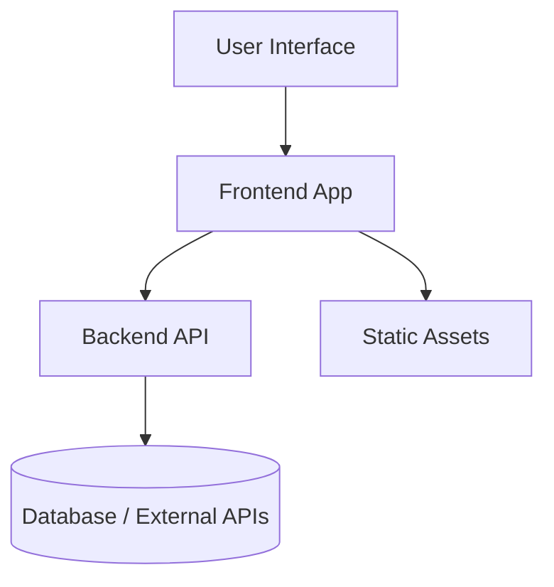

# Overview

OdooxKAHE is a travel-planning web app enabling users to search activities, assemble multi-day itineraries, and share trips with friends.

Key components

- Frontend: `frontend/` — Vite + React + TypeScript
- Backend: `backend/` — Node (Express) API
- Shared: `frontend/src/shared` — common types, hooks, services

Top-level layout

- `frontend/` — UI app and components
- `backend/` — API server and data-layer adapters
- `docs/` — human-facing project documentation (this folder)

Architecture overview

This repository focuses on clear separation between UI and backend concerns. See the Backend and Frontend docs for deeper diagrams and responsibilities.
