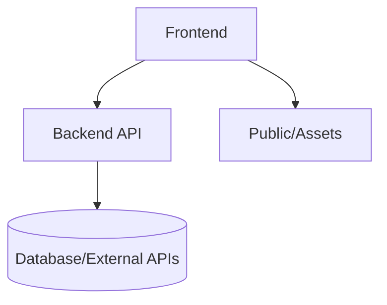

# Overview

This repository implements OdooxKAHE — a travel planning web app built with a React + TypeScript frontend and a Node backend.

Key components:
- Frontend: [frontend](frontend) (Vite + React + TypeScript)
- Backend: [backend](backend) (Node / Express)
- Shared utilities: `src/shared` (types, services, utils)

Project layout (top-level):

```text
frontend/   # UI app (Vite)
backend/    # API server
README.md   # This file
docs/       # Project docs (you are here)
```

High-level flow:


See the detailed docs for backend, frontend, and development instructions.
