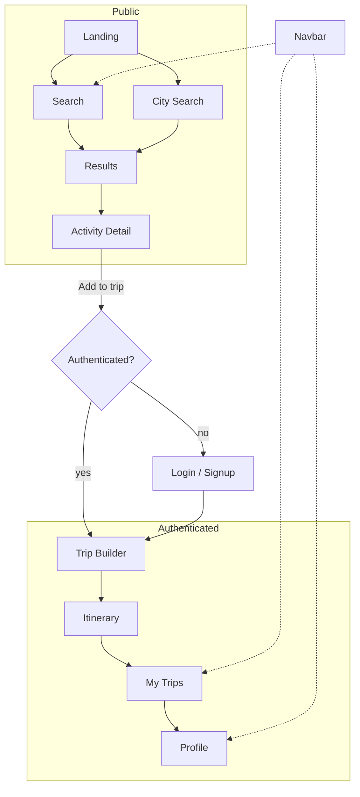
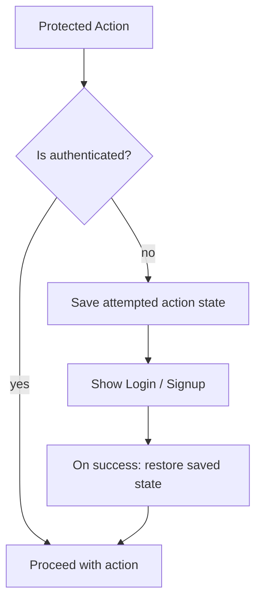
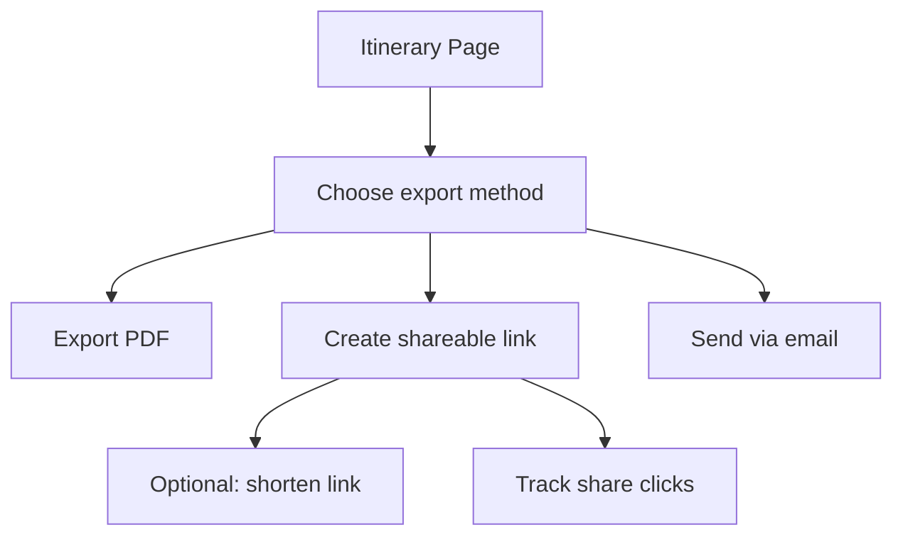
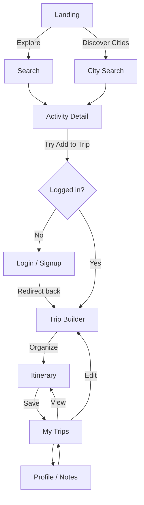
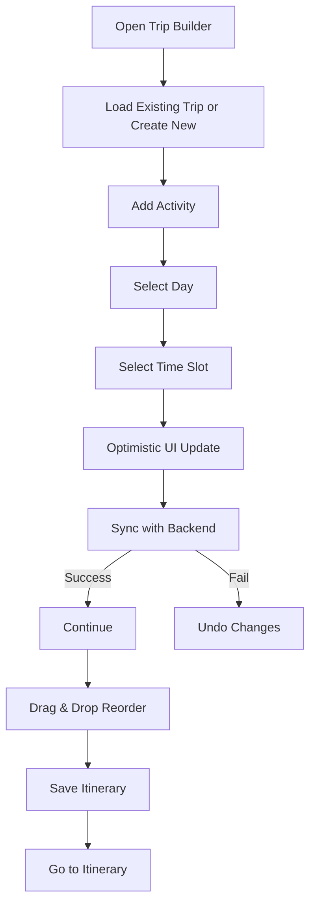

# Pages & User Flows (Diagrams)

This document visualizes the primary page-to-page journeys and interactions using Mermaid flow diagrams. Each diagram has a short caption explaining the logic and decision points.

## 1 — High-level User Navigation



Caption: A user begins at marketing pages, discovers activities, views details, and either adds items to a trip (auth required) or is prompted to sign in and returned to the builder.

## 2 — Add-to-Trip Modal Flow (Activity Detail)

```mermaid
flowchart TD
  D[Activity Detail] --> OpenModal[Open "Add to Trip" Modal]
  OpenModal --> ChooseDay[Choose existing day or create new day]
  ChooseDay --> ChooseTime[Choose time / slot]
  ChooseTime --> Confirm[Confirm add]
  Confirm -->|optimistic| Builder[Update Trip Builder UI]
  Builder --> Persist[Persist in background]
  Persist -- success --> SuccessToast[Show success]
  Persist -- fail --> UndoOption[Show undo / retry]
```

Caption: Adding an activity uses optimistic UI: show immediate change, persist in background, and handle failures with undo or retry.

## 3 — Trip Builder Editing Flow

```mermaid
flowchart LR
  Builder[Trip Builder] --> AddItem[Add Activity]
  Builder --> Reorder[Drag / Reorder]
  Builder --> EditDetails[Edit activity details]
  Builder --> SaveDraft[Save Draft (local or server)]
  SaveDraft --> AutoSave[Auto-save every X seconds]
  Builder --> Publish[Publish / Share]
  Publish --> ShareLink[Generate share link / export PDF]
```

Caption: The Trip Builder is the main composition surface — users can add, reorder, edit, save drafts, and publish/share itineraries.

## 4 — Auth Redirect Pattern (Protected Actions)



Caption: When a protected action is attempted by an unauthenticated user, save the action context, perform auth, then resume the original action.

## 5 — Save & Share / Export Flow



Caption: Offers multiple export paths; share links may be shortened and tracked for analytics.

## 6 — Detailed User Journey: Landing → Trip Saved



Caption: Complete user journey from discovery to saved trip. Authentication gates the builder, and users can revisit trips to edit or view details.

## 7 — Trip Builder Detailed Operations



Caption: The Trip Builder supports loading, adding, reordering activities with optimistic updates, and syncing changes to the backend. Failures trigger rollback.

---

See [Architecture](architecture.md) for app structure and component hierarchy.
See [Frontend](frontend.md) for page responsibilities and UI patterns.
