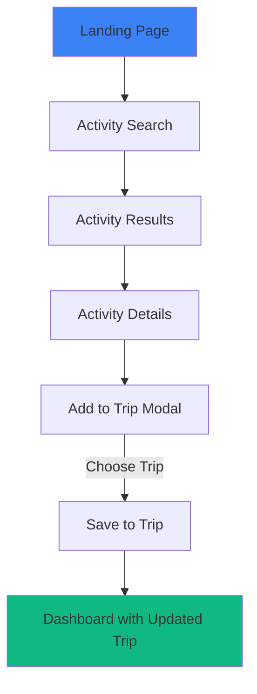
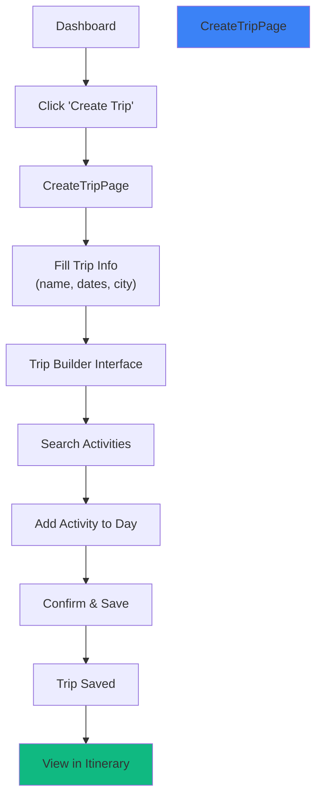
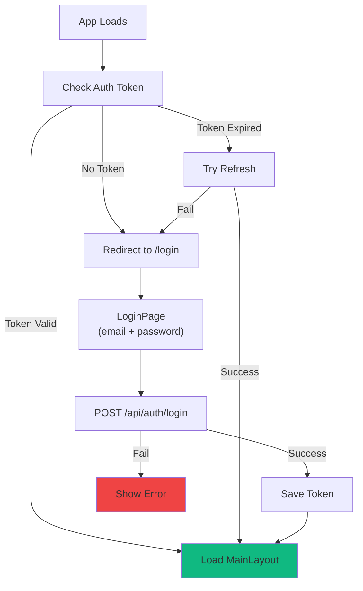

# Frontend Architecture

This document details the frontend structure, pages, components, flows, and development patterns.

---

## Folder Structure

```
frontend/
├── src/
│   ├── app/                          # Core app structure
│   │   ├── components/
│   │   │   └── Sidebar.tsx
│   │   ├── layouts/
│   │   │   ├── AuthLayout.tsx        # Login/Signup layout
│   │   │   └── MainLayout.tsx        # Authenticated layout
│   │   ├── providers/
│   │   │   └── QueryProvider.tsx     # React Query setup
│   │   └── router/
│   │       └── routes.tsx            # Route definitions
│   │
│   ├── modules/                      # Feature modules (self-contained)
│   │   ├── auth/
│   │   │   ├── pages/
│   │   │   │   ├── LoginPage.tsx
│   │   │   │   └── SignupPage.tsx
│   │   │   ├── components/           # Auth-specific components
│   │   │   └── hooks/                # Auth-specific hooks
│   │   │
│   │   ├── landing/
│   │   │   ├── LandingPage.tsx
│   │   │   ├── landing.css
│   │   │   └── sections/
│   │   │       ├── Hero.tsx
│   │   │       ├── Destinations.tsx
│   │   │       ├── Analytics.tsx
│   │   │       ├── AiCompanion.tsx
│   │   │       ├── Testimonials.tsx
│   │   │       ├── Community.tsx
│   │   │       ├── Cta.tsx
│   │   │       └── Footer.tsx
│   │   │
│   │   ├── activities/
│   │   │   └── pages/
│   │   │       ├── ActivitySearchPage.tsx
│   │   │       └── CitySearchPage.tsx
│   │   │
│   │   ├── dashboard/
│   │   │   ├── pages/
│   │   │   │   ├── DashboardPage.tsx
│   │   │   │   └── InspirationPage.tsx
│   │   │   └── components/
│   │   │       └── Navbar.tsx
│   │   │
│   │   ├── trips/
│   │   │   └── pages/
│   │   │       ├── CreateTripPage.tsx
│   │   │       └── MyTripsPage.tsx
│   │   │
│   │   ├── itinerary/
│   │   │   └── pages/
│   │   │       └── ItineraryPage.tsx
│   │   │
│   │   ├── budget/
│   │   │   └── pages/
│   │   │       └── BudgetPage.tsx
│   │   │
│   │   └── profile/
│   │       └── pages/
│   │           ├── ProfilePage.tsx
│   │           ├── NotesPage.tsx
│   │           ├── PackingPage.tsx
│   │           └── SharedTripsPage.tsx
│   │
│   ├── shared/                       # Shared utilities & services
│   │   ├── services/
│   │   │   └── apiService.ts         # All API calls centralized
│   │   ├── types/
│   │   │   └── index.ts              # Shared TypeScript types
│   │   ├── hooks/
│   │   │   └── index.ts              # Custom React hooks
│   │   ├── constants/
│   │   │   └── index.ts              # App constants
│   │   └── utils/
│   │       └── index.ts              # Helper functions
│   │
│   ├── store/
│   │   └── authStore.ts              # Auth state persistence
│   │
│   ├── App.tsx                       # Root component
│   ├── main.tsx                      # Entry point
│   ├── App.css
│   └── index.css
│
├── public/                           # Static assets
├── vite.config.ts
├── tsconfig.json
├── tailwind.config.ts
└── package.json
```

---

## Core Components

### App.tsx → Root Component

Entry point that wraps all providers:

```
QueryProvider
  ↓
Router
  ↓
Routes → Layouts → Pages
```

### QueryProvider

Wraps the app with React Query configuration. Handles:
- Automatic request caching
- Background refetching
- Stale data management
- Error handling

### Router (routes.tsx)

Defines all routes:
- **Public routes:** Landing, LoginPage, SignupPage, ActivitySearchPage, CitySearchPage
- **Protected routes:** Dashboard, DashboardPage, InspirationPage, ItineraryPage, MyTripsPage, CreateTripPage, ProfilePage, NotesPage, PackingPage, SharedTripsPage, BudgetPage

Protected routes redirect unauthenticated users to login.

### Layouts

**AuthLayout:** Used for Login/Signup pages (minimal header, centered form)

**MainLayout:** Used for authenticated pages (Navbar + Sidebar + main content)

---

## Pages & Responsibilities

### Public Pages

| Page | Route | Purpose |
|------|-------|---------|
| **LandingPage** | `/` | Hero, features, testimonials, CTA |
| **ActivitySearchPage** | `/activities` | Search activities by keyword |
| **CitySearchPage** | `/cities` | Browse activities by city |
| **LoginPage** | `/login` | User authentication |
| **SignupPage** | `/signup` | User registration |

### Authenticated Pages

| Page | Route | Purpose |
|------|-------|---------|
| **DashboardPage** | `/dashboard` | Home view with trip overview |
| **InspirationPage** | `/inspiration` | Discover new trips & itineraries |
| **MyTripsPage** | `/trips` | User's saved trips (list view) |
| **CreateTripPage** | `/trips/create` | Trip builder & editor |
| **ItineraryPage** | `/itinerary/:tripId` | Day-by-day trip planning |
| **ProfilePage** | `/profile` | User account settings |
| **NotesPage** | `/profile/notes` | Personal trip notes |
| **PackingPage** | `/profile/packing` | Packing list per trip |
| **SharedTripsPage** | `/profile/shared` | Trips shared with user |
| **BudgetPage** | `/budget` | Trip budget tracking |

---

## User Navigation Flows

### Discovery to Save



### Trip Creation



### Authentication



---

## Component Patterns

### Page Component Pattern

Every page component:
1. Uses React Query hook to fetch data
2. Shows loading state
3. Shows error fallback
4. Renders content with fetched data

**Example:**
```typescript
export function MyTripsPage() {
  const { data: trips, isLoading, error } = useQuery(
    ['trips'],
    () => apiService.getTrips()
  );

  if (isLoading) return <Loading />;
  if (error) return <Error message={error.message} />;
  
  return <TripsGrid trips={trips} />;
}
```

### Mutation Pattern (Save/Update)

For forms and actions:
1. Use `useMutation` from React Query
2. Show loading state during API call
3. Update cache on success
4. Show success/error message

**Example:**
```typescript
const mutation = useMutation(
  (trip) => apiService.saveTrip(trip),
  {
    onSuccess: (data) => {
      queryClient.invalidateQueries(['trips']);
      showSuccessToast('Trip saved!');
    }
  }
);
```

### Optimistic UI Pattern

Update UI immediately, rollback on error:

```typescript
queryClient.setQueryData(['trip', id], updatedTrip);
// Later: React Query handles rollback if mutation fails
```

---

## Styling with Tailwind

**Configuration:** `tailwind.config.ts`

All styles use Tailwind utility classes. No CSS-in-JS needed.

**Custom CSS:** See `landing.css` for module-specific styles

---

## State Management

### Local State
Component state for UI (open/closed menus, form inputs, etc.):
```typescript
const [isOpen, setIsOpen] = useState(false);
```

### Server State
Data from API, managed by React Query:
```typescript
const { data } = useQuery(['trips'], getTrips);
```

### Auth State
User login info persisted to localStorage:
```typescript
// See authStore.ts and profile/ProfilePage.tsx
```

---

## Development Tips

### 1. Adding a New Page

1. Create file in `src/modules/feature/pages/FeaturePage.tsx`
2. Add route to `src/app/router/routes.tsx`
3. Use React Query hooks for data fetching
4. Place reusable components in `src/modules/feature/components/`

### 2. Adding a New API Call

1. Add method to `src/shared/services/apiService.ts`
2. Use in page with React Query `useQuery` or `useMutation`
3. Share types in `src/shared/types/index.ts`

### 3. Debugging

Use React Query DevTools:
```typescript
import { ReactQueryDevtools } from '@tanstack/react-query-devtools';
// Already configured in QueryProvider
```

---

## Next Steps

- **Setup & Running:** [GETTING_STARTED.md](GETTING_STARTED.md)
- **System Architecture:** [architecture.md](architecture.md)
- **Backend Services:** [backend.md](backend.md)
- **API Endpoints:** [API.md](API.md)
